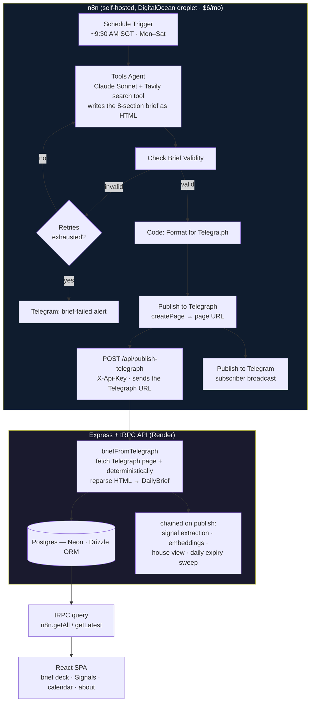

# Architecture

This is the deep-dive behind the summary in [README.md](./README.md): what runs where, why the pipeline is shaped the way it is, and how it got here — including the parts that changed after the first version broke in production.

## System diagram

## Why it's shaped this way

### The publish pipeline — how it works today, and where it's headed

**Today (live): Telegraph as the structuring intermediary.** The generating agent — Claude, run through n8n's **Tools Agent** with **Tavily** as its search tool — writes the full 8-section brief as **HTML**. n8n runs a `Check Brief Validity` gate (retrying the agent, then alerting on Telegram if retries are exhausted), publishes the HTML to **Telegraph** (a free, archived, human-reviewable publishing platform), and POSTs the Telegraph URL to `/api/publish-telegraph`. The server fetches that page and **deterministically reparses** the HTML back into the strict `DailyBrief` schema (`server/telegraphImport.ts` — structural parsing, *no* second LLM), then validates and persists. Telegraph doubles as the shareable public artifact and the subscriber-broadcast target.

**The known fragility (why the migration below exists).** Telegraph's HTML is a *lossy* rendering of the brief: it carries headline, paragraphs, and sources — but not `summary`, `singaporeLens`, `tags`, `urgency`, `readingTime`, or the systems-synthesis block cleanly. The reparser re-derives those from the rendered HTML with heuristics, so every time the model's HTML drifts even slightly (a missing section number, a synthesis block rendered as a blockquote instead of a heading, an unexpected category label), a field can be silently dropped or mis-tagged. The intermediary that gives us a clean archived artifact is also a second, implicit schema kept in sync by parsing rules.

**Where it's headed (planned, not yet shipped): structured JSON as the canonical artifact.** The migration is to have the agent emit the complete `DailyBrief` JSON in one pass against the schema and POST it directly to `/api/publish` — that endpoint already exists and Zod-validates server-side — demoting Telegraph to *one downstream rendering* of that JSON rather than a step the pipeline depends on. The field-by-field gap and rationale are the postmortem in [BRIEF_FORMAT.md](./BRIEF_FORMAT.md).

*(Verified against the live n8n workflow (MVP 2.02): the Telegraph path above is the source of truth today; the direct-`/api/publish` flow is the planned next step, not the current one.)*

### Two-layer validation, not one

Every brief is checked twice: once inside n8n before the HTTP call (the `Check Brief Validity` gate — cheap, fails fast, retries the agent and keeps obviously broken payloads off the wire), and again server-side at the publish API boundary before it touches the database. The n8n-side check is a convenience; the server-side check is the actual security boundary — an LLM-authored payload is treated exactly like any other untrusted input, never like a trusted internal caller just because it's "your own" workflow.

### Rigid schema, flexible generation

The schema is deliberately strict — 12 fixed fields per section, typed metric values, a controlled category vocabulary keyed to emoji rather than free-text labels. All of the model's flexibility is pushed into the prose (headline, summary, paragraphs, analysis), never into the shape of the data. This is what makes a swipeable deck, the Signals intelligence dashboard, and a calendar archive all reliable renderers of the same underlying object — the UI never has to defensively guess at what shape the data might be in today.

### Signals: two tracking mechanisms, deliberately different

**Signals** is the feature that holds the brief accountable to its own calls. There are actually two mechanisms behind it, used for two different kinds of claim:

- **Deterministic, for numeric thresholds.** A claim like "watch Brent above $90" is extracted from the brief's own analytical prose via a cue-word convention (`watch`, `monitor`, `brace for`, `the tell`, etc.), using one shared extractor so the story card and the Signals page's watch list always agree. It's marked *realized* the moment the app's own market series crosses the stated threshold — pure arithmetic, no model judgment involved, because there's no judgment call to make.
- **Agentic, with calibrated autonomy, for everything else.** A qualitative call ("if the Fed holds, expect this on mortgages") can't be resolved by a threshold check — realizing it is a judgment call. That's handled by a separate background agent system, detailed below, that scores its own confidence and only acts alone when it's confident; otherwise it asks a human.

The full agent system — what actually forms the house view, tracks these calls over time, and writes the theme narrative — is its own layer, covered next.

## The Signals subsystem — "Agentic Ripple"

This is the part of the system I'd lead with in a technical interview: it's a small multi-agent pipeline with its own observability, not a single LLM call dressed up as a feature.

### Four background agents, one status table

Every background job — regardless of what it does — writes a row to a single `job_runs` table (`job`, `status`, `started_at`, `finished_at`, `summary` jsonb). That one convention is what makes the whole thing observable from one place instead of four:

| Job | Cadence | What it does |
|---|---|---|
| **`signal`** | Daily, chained to publish | Extracts qualitative, forward-looking calls out of each newly published brief into a persisted `signals` ledger — theme, the call's text, the headline it came from, when it surfaced, an optional horizon date, and a hard expiry date. Starts life with `status = "open"`. |
| **`alpha`** (house view) | Daily, chained to publish | One `claude-sonnet-4-6` call over the open-signal ledger forms the **house view**: a headline, a thesis, a stance, and — critically — `signal_refs`, an explicit array linking the view back to the specific signals that back it up. Kept daily deliberately — freshness is the whole point, and it's cheap (~$0.20/month). |
| **`realise`** | Weekly (Sunday), in-process scheduler on Render — not n8n | Sweeps every open signal: a deterministic numeric sweep checks threshold signals against a live market-data feed first (exclusive domain — no LLM involved if a tracked instrument's level is being judged), then a `claude-haiku-4-5` web-grounded sweep (Tavily search) scores confidence on everything else. **≥0.85 → auto-`realised`** with evidence attached; **0.50–0.85 → `pending_review`**, queued for a human; **below 0.50 → stays `open`**, rechecked next week. Expired signals are swept out on every publish, not just weekly. |
| **`synthesis`** | Weekly (Sunday) for all windows, since 2026-07-23 — was daily for the 1W window before that | Reads across signals and briefs within a theme and a time window (1W / 1M / 3M) and writes the pre-generated narrative prose that powers the Signals page — including which theme, if any, is the "dominant" story of that window. Moved off the daily path specifically to cut cost (below). |

### Why `realise` doesn't just decide on its own

This is the design decision in this subsystem I'd defend hardest — and it's backed by an incident, not just a hypothetical. Early on, a market signal got marked "realised" because a news snippet mentioned Brent at $126, when the app's own live price series showed Brent around $81 — the web-grounded LLM sweep trusted a scraped number over ground truth it already had. Separately, the House View agent once stated a specific SORA rate ("reprices SORA above 3.8%") it had no live data for — the real rate was closer to 1%; plausible-sounding, fabricated.

Two guardrails came out of that, and both matter more than the incidents themselves: **(1)** any signal that names a tracked instrument and a level is now the deterministic numeric sweep's exclusive domain — the LLM-driven web sweep is not allowed to touch it at all, so a scraped snippet can never overrule the app's own market-data feed; **(2)** every generation prompt (realisation verdicts, house view, theme synthesis) is now explicitly forbidden from stating a price/rate/level that isn't written verbatim in its source data — reason about direction and mechanism, never invent a number.

On top of that, confidence gating: an agent that silently auto-resolves qualitative calls will eventually mark something "realised" that wasn't — and for a feature whose entire point is *holding the brief accountable to itself*, a wrong "realised" is worse than an unresolved one; it's a system lying about its own track record. So the web-grounded sweep only acts unilaterally above **0.85 confidence** (auto-`realised`, with evidence attached); between **0.50 and 0.85** it stops and hands off to a small editorial queue (`confirmSignal` / `dismissSignal` / `reopenSignal`, all admin-key-protected tRPC mutations, worked from a `/admin/signals` page); below **0.50** it stays open and gets rechecked the following week. That's the calibrated-autonomy pattern — know what your agent is actually confident about, put a hard rule in front of the part that shouldn't be a judgment call at all, and design the fallback for everything else — that maps directly onto the human-in-the-loop requirements of any regulated-industry AI deployment.

### Cadence is a cost decision, not just a freshness one

Theme synthesis (1W/1M/3M) originally regenerated on every daily publish. It now regenerates weekly, in the same Sunday sweep as `realise`, because synthesis was the layer's dominant LLM cost and aggregate themes move slowly enough that a stale-for-up-to-6-days theme card is an acceptable trade. Combined with prompt caching on the repeated system/context prefix across each theme's 2–3 model calls (~90% off on the cached portion), automated synthesis spend dropped from roughly **$4.25/month to $1.6/month**. The house view stayed on the daily path deliberately — it's the one place freshness is non-negotiable, and at one Sonnet call a day it only costs about **$0.20/month**. That's the kind of trade-off that's easy to state in principle and easy to get wrong in practice without a cost number attached to each path — which is the whole argument for [COST_TRACKING.md](./COST_TRACKING.md).

### RAG layer (retrieval + optional cited synthesis)

Every brief section (headline + paragraphs + Singapore Lens) is chunked and embedded — OpenAI `text-embedding-3-small`, 1536 dimensions — into Postgres via `pgvector`, alongside embeddings of every signal's text. This backs two endpoints:

- **`search`** — free, pure cosine-similarity retrieval over signals and brief chunks. No LLM call, no cost, just ranked hits with source references.
- **`synthesizeAnswer`** — opt-in ("Synthesize" in the UI), retrieves the same way, then asks Claude Haiku to answer *using only the retrieved context*, with inline citations. The system prompt is explicit about refusing to fabricate: *"Answer the question using ONLY the numbered context provided — cite sources inline... If the context is insufficient, say so plainly rather than inventing detail."* That instruction is doing real work — it's the same anti-hallucination discipline as the numeric sanity check in [EVALUATION.md](./EVALUATION.md), applied to a different failure mode (fabricated citations instead of fabricated numbers).

Both calls are hard-gated on the relevant API key being set (`OPENAI_API_KEY`, `ANTHROPIC_API_KEY`) and no-op cleanly if it isn't — the RAG layer degrading gracefully rather than breaking the rest of the app if a key is missing or a provider is down.

### The Agent Status monitor — observability that already exists

`getAgentStatus` aggregates the most recent run of each of the four jobs plus a data-health snapshot (brief count, last brief date, chunk count, signal counts by status) into one payload the frontend renders as a status page. This is the same idea as the per-run logging proposed in [EVALUATION.md](./EVALUATION.md) and [COST_TRACKING.md](./COST_TRACKING.md) — both of those are written to extend this existing `job_runs` pattern (new `job` values, e.g. `"eval"` and `"cost"`) rather than standing up a second, disconnected logging system next to a monitor that already works.

## Data flow, end to end

1. **~9:30 AM SGT (Mon–Sat)** — n8n's schedule trigger fires.
2. **Research + synthesis** — the Tools Agent (Claude) runs Tavily searches across the day's geopolitics, markets, technology, science and culture developments and writes the full 8-section brief (7 stories + 1 systems-synthesis section), with per-section Singapore Lens, key metrics, and sourced links, as **HTML**.
3. **Validity gate** — a `Check Brief Validity` node screens the output; on failure it retries the agent, and if retries are exhausted it alerts a Telegram error channel instead of publishing.
4. **Publish to Telegraph** — the HTML is formatted and published to Telegraph (`createPage`), which returns a page URL and serves as the archived, shareable artifact.
5. **Ingest** — n8n POSTs that Telegraph URL to `/api/publish-telegraph` with an API key.
6. **Reparse + persist** — the server fetches the Telegraph page and **deterministically reparses** the HTML into the `DailyBrief` schema, then upserts it into Postgres by `dateSlug` (idempotent — a republish updates, not duplicates). Signal extraction, chunk embeddings, the house view, and the daily expiry sweep are chained off this publish.
7. **Serve** — the React SPA queries the latest/all briefs via tRPC (`n8n.getLatest`, `n8n.getAll`) and renders the deck, the **Signals** dashboard, and the calendar.
8. **Distribute** — a Telegram message notifies subscribers with a link to the day's brief.

## Stack rationale

| Decision | Alternative considered | Why this choice |
|---|---|---|
| n8n self-hosted on a $6/mo droplet | n8n Cloud, Zapier, Make | Full node-level control (custom Code nodes for validation/extraction) at a fixed, minimal cost |
| Tavily for search | Google/Bing APIs, raw scraping | Purpose-built for LLM consumption — cleaner structured results, less parsing overhead |
| Claude for synthesis | GPT-4-class alternatives | Long-context synthesis quality and reliable structured JSON output across an 8-section brief |
| Zod validation, both sides | Trust the LLM output as-is | An LLM writing to a production datastore is an untrusted input source, full stop |
| Postgres (Neon/Supabase) + Drizzle | Firebase, hardcoded TS files (the original MVP approach) | Typed schema, real migrations, unlimited scale vs. hand-maintained brief files per day |
| tRPC over REST | REST + OpenAPI | End-to-end type safety between server and SPA with no schema duplication |
| Render for hosting | Railway, Vercel + serverless | Free-tier Blueprint deploy straight from `render.yaml`; single Node process serves both API and SPA |

## What's next architecturally

See [EVALUATION.md](./EVALUATION.md) and [COST_TRACKING.md](./COST_TRACKING.md) for the two layers being added on top of this pipeline: automated output-quality scoring per run, and per-run token/cost logging. Both are designed as additive n8n nodes — they don't require restructuring the pipeline above, which is itself a deliberate property: the core pipeline should be stable enough that observability can be bolted on without a rewrite.
